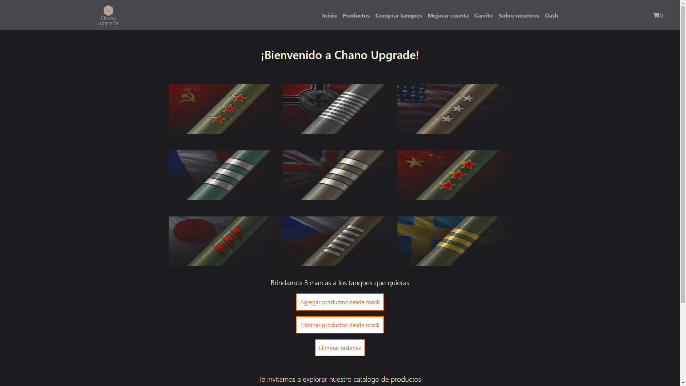
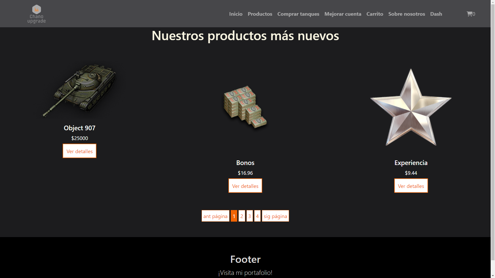
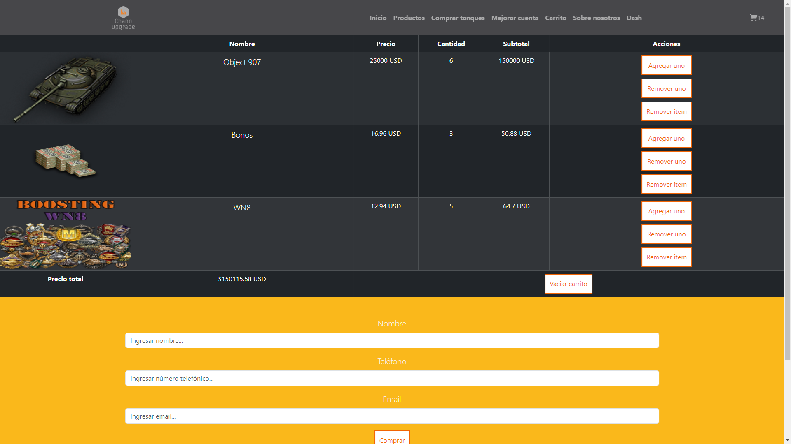

# React Ecommerce

An ecommerce project made with react, where it is carried out thanks to the React course from Coderhouse

https://worldoftanks-react-ecommerce.netlify.app/

## Screenshots






## Tools Used

- React with Vite (with JavaScript XML (jsx))
- Firebase
  - Firestore
- react-router-dom
- react-slick
- slick-carousel
- react-bootstrap
- fontawesome


## Environment Variables

To run this project, you will need to add the following environment variables to your .env file

`VITE_API_KEY`

`VITE_AUTH_DOMAIN`

`VITE_PROJECT_ID`

`VITE_STORAGE_BUCKET`

`VITE_MESSAGING_SENDER_ID`

`VITE_APP_ID`


## Installation and Testing

Install my-project with npm

```bash
  cd react-project
  npm install
```

After installation

```bash
  npm run dev
```


## Authors

- [@Juan Ignacio Caprioli (ChanoChoca)](https://github.com/ChanoChoca)


## Badges

[//]: # (Add badges from somewhere like: [shields.io]&#40;https://shields.io/&#41;)

[](https://choosealicense.com/licenses/mit/)
[](https://opensource.org/licenses/)
[](http://www.gnu.org/licenses/agpl-3.0)
